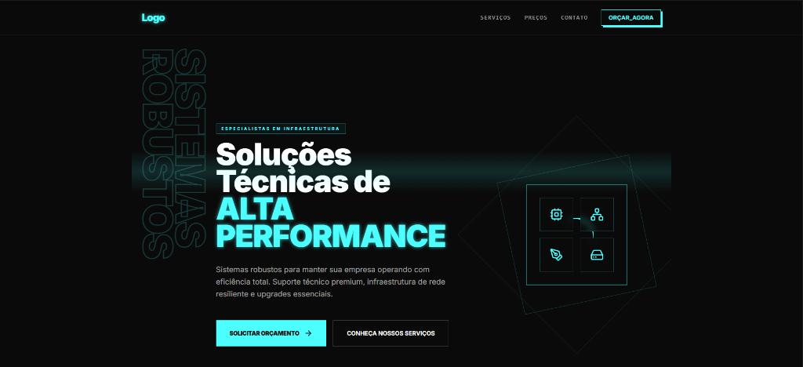
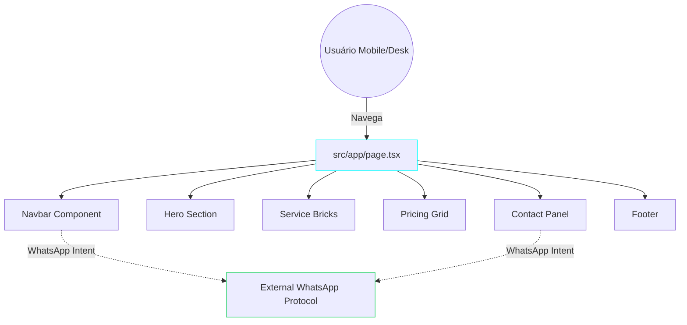

# 🌐 OpenCode (Robust IT Solutions)

> 🇧🇷 (Portuguese) / 🇺🇸 (English) versions available below.

---

## 🇧🇷 Português (PT-BR)

### 📋 Sobre o Projeto
**OpenCode / Logo IT Solutions** é uma landing page corporativa de alta performance desenvolvida em **Next.js (App Router)** e **TypeScript**, focada em infraestrutura de sistemas técnicos comerciais. O projeto foi projetado adotando as melhores práticas vigentes de **SEO Avançado**, **Acessibilidade WAI-ARIA**, design responsivo "Mobile-First" sem degradação visual, e mitigação ativa de vetores listados no **OWASP Top 10**.

### 🎯 Funcionalidades
- 🚀 **Animações Fluidas:** Uso robusto do Framer-Motion para transições premium.
- 📱 **Mobile-First & Responsividade Absoluta:** Ajuste fluido sem barras de rolagens parasíticas e menu retrátil state-driven.
- 🕵️ **Semântica Estruturada (Zero-divs desnecessárias):** Máxima observância a `article`, `section`, `nav`, garantindo melhor parsing nos motores de busca e compliante com a LGPD.
- 🛒 **Grade de Serviços Tiers:** "Service Bricks" assimétricos e pacotes de Preços flutuantes com foco forte em UI/UX de conversão.

### 🏗️ Estrutura Técnica (Layered Architecture)
O aplicativo desfruta de um fluxo de dados baseado em componentes reativos bem desacoplados (inspirado por práticas SOLID num paradigma Funcional):

```text
/src
 ├── /app/
 │   ├── layout.tsx         # Configuração Global de Metadatas, Fontes e CSS Root
 │   ├── page.tsx           # Página Principal (Centralizadora de Sections)
 │   └── globals.css        # Variáveis e CSS Overrides (ex: Remoção Tracker NextJS)
 ├── /components/
 │   ├── /layout/           # Elementos Globais (Navbar, Footer, Mobile Menu)
 │   └── /sections/         # Peças de Montagem (Hero, ServiceBricks, Contact...)
 └── /lib/                  # Utilitários globais como o `cn` (Tailwind Merge)
```

### 🧠 Princípios de Engenharia Aplicados

| Prática | Aplicação na Base |
| :--- | :--- |
| **S** (Single Responsibility) | Componentização cirúrgica. Ao invés de uma "Mega Página", as responsabilidades foram fatiadas (`HeroSection.tsx`, `PricingGrid.tsx`). |
| **Acessibilidade (ARIA)** | Todos os botões e Call-To-Actions (WhatsApp) possuem rótulos lidos por tecnologias assistivas para portadores de deficiência `aria-label=...`. |
| **Performance (SSR)** | Abordagem SSR hibrida do NextJS + Desativação de flags gulosas do sistema de monitoramento em Dev. |

### 📊 Diagrama de Componentes e Fluxo



### 🛡️ Segurança (OWASP)
Alinhado com a **Métrica A01:2021 (Broken Access Control)** e prevenção primária de Hijack por Window Opener: a landing page possui proteções agressivas em todos os redicionamentos externos (`target="_blank"`), encapsulando forçosamente o flag **`rel="noopener noreferrer"`**.

### 🚀 Como Executar Localmente
O código é alimentado e empacotado via ecossistema React/Next moderno. 

**Requisitos:** Node.js v18+.
1. Abra o diretório do projeto no terminal (`.../projetos/opencode`).
2. Instale as dependências com `npm install`.
3. Rode o servidor de desenvolvimento: `npm run dev`.
4. Abra `http://localhost:3000` em seu navegador.

---

## 🇺🇸 English (EN)

### 📋 About the Project
**OpenCode** is a premium corporate landing page geared towards enterprise IT infrastructure, natively powered by **Next.js (App Router)** & **TypeScript**. The application shines by adhering to strict **Advanced SEO guidelines**, **WAI-ARIA Accessibility** rulesets, and mitigating crucial **OWASP Top 10** attack vectors seamlessly.

### 🎯 Core Features
- 🚀 **Fluid Aesthetics:** High-fidelity animations powered fundamentally by framer-motion layers.
- 📱 **True Mobile-First Focus:** Responsive, un-cluttered interface boasting a state-driven retractable mobile menu.
- 🕵️ **Semantic Precision:** Meaningful HTML5 tags (`<section>`, `<nav>`) paired against "div-hell" guaranteeing extreme Search Engine Indexing output capabilities.
- 🛒 **Service Tiers Breakdown:** Asymmetric service grids and transparent pricing models utilizing glowing interactive layouts.

### 🏗️ Technical Layered Architecture
Component separation adheres to the React-flavor single responsibility boundaries.

```text
/src
 ├── /app/
 │   ├── layout.tsx         # Root layout, injection metadata and Global CSS injection
 │   └── page.tsx           # Page orchestrator 
 ├── /components/
 │   ├── /layout/           # Global wrappers (Navbar with mobile-state, Resilient Footer)
 │   └── /sections/         # Logical partitions (HeroSection, PricingGrid...)
```

### 🧠 Engineering Principles Deployed

| Principle | Immediate Application |
| :--- | :--- |
| **Componentization** | Decoupling the single page structure into modular files minimizing maintenance chaos footprint (`PricingGrid.tsx`). |
| **Inclusive Design** | Comprehensive ARIA labeling applied dynamically onto interactive objects and anchor points ensuring screen-reader legibility. |

### 🛡️ Security Standard (OWASP)
The project actively mitigates vulnerabilities outlined in the **OWASP Top 10** (specifically reverse-tab-nabbing risks), enforcing secure payload redirects using robust `rel="noopener noreferrer"` parameters natively across all external protocols (like WhatsApp intent triggers).

### 🚀 Running the App
Powered by modern Next.js environments, typical NodeJS tooling applies:
1. Fire up a terminal inside `/projetos/opencode`.
2. Sync dependencies using `npm install`.
3. Trigger the NextJS CLI compiler through `npm run dev`.
4. Target `http://localhost:3000` on your preferred browser.
